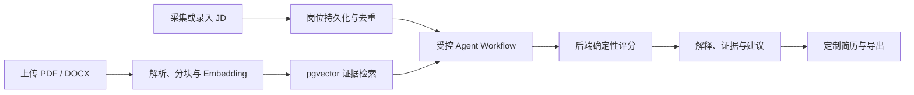
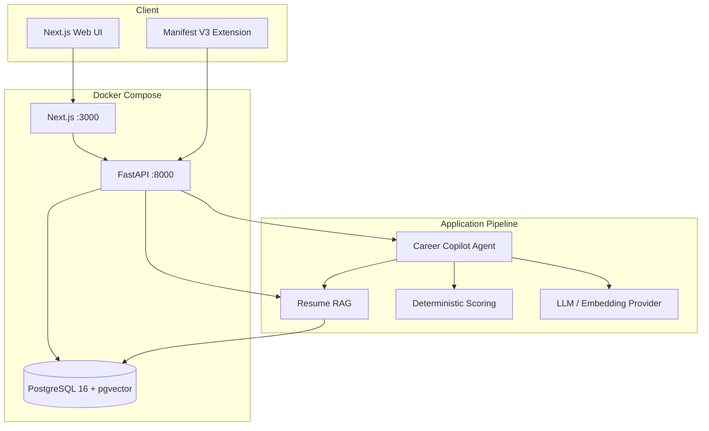

# CareerMatrix

> AI-Powered Career Intelligence & Decision System

CareerMatrix 是一个 AI career intelligence 与决策支持系统，围绕多维岗位/候选人匹配、岗位发现、申请规划、RAG 证据检索、受控 Agent workflow、申请跟踪与人工确认，提供可解释的职业决策支持。

> 项目边界：不自动投递，不自动发送招聘消息，不替代用户判断；匹配分数用于解释候选人与岗位要求的覆盖情况，不等于录用概率。

[项目主页](https://github.com/qinpei-dev/career-matrix) · [文档入口](docs/README.md) · [架构说明](docs/architecture.md) · [本地部署](DOCKER.md)

## 产品预览

| Dashboard | Jobs |
| --- | --- |
|  |  |

| Job Detail | Resume Knowledge Base |
| --- | --- |
|  |  |

## 项目解决什么问题

传统的岗位收藏、简历修改和面试准备通常分散在多个工具中，而且模型生成的“匹配分”很难追溯。CareerMatrix 将这些动作收敛到同一个职业决策工作区：

- 从浏览器扩展或表单保存岗位，并通过 fingerprint 保证重复保存幂等。
- 上传 PDF / DOCX 简历，完成解析、分块、Embedding 和 pgvector 检索。
- 让模型提取岗位要求与候选人证据，但由后端规则计算最终分数。
- 持久化 AnalysisTask、Agent Run、步骤、证据和结果，支持恢复、重试与人工确认。
- 基于已保存证据生成可编辑的定制简历版本，并导出 DOCX / PDF。

## 核心流程



1. **岗位进入工作区**：Extension 或 Web API 提交 JD；URL、内容归一化和唯一约束共同避免重复记录。
2. **简历成为知识库**：Backend 解析文档并生成 chunks，Embedding 写入 PostgreSQL + pgvector。
3. **分析任务受控执行**：工作流按固定节点读取岗位、检索证据、提取要求、计算评分并持久化状态。
4. **结果可追溯**：页面展示维度分数、优势、差距、面试建议及其简历证据来源。
5. **用户确认输出**：定制简历可编辑、保存、定稿和导出；沟通稿仅供复制，不自动发送。

## 架构



Backend 延续 `API → Application Service → Repository / Infrastructure` 分层。模型负责提取与生成，数据库约束、任务状态机和评分规则仍由应用控制。组件边界、Agent 时序和 Docker 拓扑见 [docs/architecture.md](docs/architecture.md)。

## 技术亮点

| 主题 | 实现 |
| --- | --- |
| 可解释 AI | RAG 返回真实简历 chunks；分析结果保存 evidence，不只输出结论 |
| 确定性评分 | LLM 不直接决定最终分数；后端按固定状态、权重和归一化规则计算 |
| 可靠任务执行 | AnalysisTask 使用 CAS/version、claim token、lease、retry 和 recovery 语义 |
| 数据幂等 | Job fingerprint 结合 URL/内容归一化、唯一约束和冲突恢复 |
| 受控 Agent | 固定工作流节点、步骤持久化、运行状态恢复，避免无限自主操作 |
| 文档工程 | PDF / DOCX 解析、内容哈希去重、失败重试、向量检索和证据回溯 |
| 安全边界 | 外部 JD / 简历按不可信文本处理；密钥只进入 Backend；不自动投递或发送 |
| 本地可复现环境 | Compose healthcheck、Alembic、幂等 Seed、Windows 启停脚本和 named volume |

## 技术栈

| 层 | 技术 |
| --- | --- |
| Frontend | Next.js 16、React 19、TypeScript、Tailwind CSS |
| Backend | FastAPI、SQLAlchemy 2、Pydantic、Uvicorn |
| Database | PostgreSQL 16、pgvector、Alembic |
| AI | OpenAI-compatible LLM / Embedding、RAG、受控 Agent Workflow |
| Browser | Manifest V3 Extension、Native Messaging（Windows / Edge） |
| Deployment | Docker、Docker Compose、healthcheck、named volume |

## 快速启动

前置条件：Windows、Docker Desktop，以及可拉取项目镜像依赖的网络环境。

直接双击根目录的 `start_demo.bat`（为兼容保留的文件名）。启动器会构建并启动 PostgreSQL、Backend、Frontend，等待健康检查，执行 Alembic migration，在空库时导入本地 Seed，最后打开 <http://localhost:3000>。

需要桌面快捷方式时，在项目根目录执行一次：

```powershell
powershell.exe -NoProfile -ExecutionPolicy Bypass -File scripts/create_desktop_shortcut.ps1
```

如果移动或重命名项目目录，请在新根目录重新运行上述命令，以当前路径重新创建桌面快捷方式。Edge Native Messaging 的安装与路径更新不属于 Docker 本地启动流程，应按对应安装说明单独处理。

访问地址：

- Frontend：<http://localhost:3000>
- Backend：<http://localhost:8000>
- Health：<http://localhost:8000/health>

停止本地环境时双击 `stop_demo.bat`。它会删除容器和 Compose network，但保留数据库卷。开发者命令、配置说明、升级步骤与排障见 [DOCKER.md](DOCKER.md)。

## 测试结果

2026-08-05 在当前工作区执行的自动化检查：

| 范围 | 命令 | 结果 |
| --- | --- | --- |
| Backend | `python -m pytest -q` | PASS — 246 passed，1 skipped |
| Python 编译 | `python -m compileall -q backend/app` | PASS |
| Frontend | `npm test` | PASS — 26 passed |
| Frontend 类型 | `npm run typecheck` | PASS |
| Frontend 构建 | `npm run build` | PASS |
| Extension | `node --test extension/tests/content.test.js extension/tests/popup.test.js` | PASS — 2 passed |
| Compose 配置 | `docker compose config --quiet` | PASS |

自动化测试合计 **274 passed，1 skipped**。当前 Alembic 唯一 head 为 `20260730_0012`。本表不代表本次重新执行了真实 Provider、浏览器人工 E2E 或完整 Docker 运行态验收；历史材料仅为追溯保留，不作为当前产品入口。

## 已知限制

- 当前目标是单机本地部署，不是公网生产部署。
- 本地开发认证 Token 会进入前端 bundle，不等同于生产鉴权；公网部署前必须替换为正式身份认证。
- LLM / Embedding 的可用性、延迟和质量取决于本地配置与外部 Provider。
- Extension 使用通用启发式提取，不承诺适配所有招聘网站。
- 当前没有正式账号体系、RBAC、云同步、多人协作、备份和高可用方案。
- 不提供自动投递、自动聊天或绕过招聘网站限制的能力。
