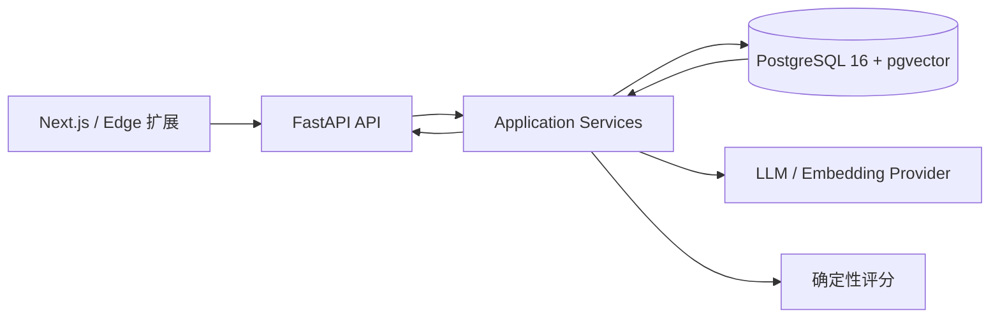

# CareerMatrix

> AI-Powered Career Intelligence & Decision System

CareerMatrix 是面向本地演示与技术交流的职业决策工作区：保存岗位和简历，以简历片段检索为证据，生成可追溯的岗位分析与可编辑的定制简历。分数表示规则下的要求覆盖程度，不是录用概率。系统不会自动投递或发送招聘消息。

[架构](docs/architecture.md) · [文档索引](docs/README.md) · [Docker 启动](DOCKER.md) · [项目状态](docs/project-status.md)

## 已实现的主流程

1. 在 Web 工作区录入岗位，或用 Manifest V3 扩展读取网页 JD 后保存。后端通过 URL、内容归一化和 fingerprint 处理重复岗位。
2. 上传 PDF / DOCX 简历；后端解析、分块并调用配置的 Embedding provider，在 PostgreSQL + pgvector 中保存向量并检索相关片段。
3. 创建分析任务或 Agent Run。模型提取要求并生成说明；后端根据固定规则计算匹配分数，保存证据、步骤和状态。
4. 从已上传简历的证据生成定制简历草稿，人工编辑和定稿后导出 DOCX。

| 能力 | 当前状态 |
| --- | --- |
| 岗位 CRUD、去重，简历上传、解析、检索，候选人资料及 Profile Draft | 已实现；外部 Provider 的效果取决于本地配置 |
| AnalysisTask 重试、claim/lease 恢复，Agent Run 步骤记录 | 已实现；Agent 中断后将旧运行标记失败，不支持从已完成步骤继续 |
| 定制简历生成、证据约束编辑、版本、DOCX 导出 | 已实现；PDF 导出路由返回 501 |
| 扩展采集、保存、分析和 Windows/Edge Native Host 启停 | 有代码和自动化测试；需手动安装、输入本地 Demo Token，真实浏览器联调未在本轮验证 |
| 正式账号认证、多人协作、云部署、自动投递 | 未实现 |

## 架构与 AI 边界


```mermaid
flowchart LR
  Browser[Next.js / Edge 扩展] --> API[FastAPI API]
  API --> Service[Application Services]
  Service --> DB[(PostgreSQL 16 + pgvector)]
  Service --> Provider[LLM / Embedding Provider]
  Service --> Score[确定性评分]
  DB --> Service
  Service --> API
```

Backend 沿用 API → Application Service → Repository / Infrastructure 分层。RAG 将命中的简历 chunk、来源和相似度交给分析流程；模型输出不能直接覆盖后端评分。Agent 使用固定步骤并持久化步骤状态。AnalysisTask 的 CAS/version、claim token 和 lease 用于冲突与中断恢复；这些机制不保证 LLM 调用 exactly once。详情见[架构说明](docs/architecture.md)。

## 技术栈与目录

| 层 | 实际依赖 |
| --- | --- |
| Web | Next.js 16、React 19、TypeScript、Tailwind CSS |
| API | FastAPI、SQLAlchemy 2、Pydantic、Alembic |
| 数据 | PostgreSQL 16、pgvector；测试主要使用 SQLite |
| AI | OpenAI-compatible Embedding、DeepSeek provider、受控 Agent workflow |
| 本地集成 | Manifest V3 扩展、Windows/Edge Native Messaging、Docker Compose |

`backend/` 包含 API、服务、模型、迁移和 pytest；`frontend/` 是工作区；`extension/` 是浏览器扩展；`native_host/` 和 `scripts/` 提供 Windows 本地启停；`docs/` 保留架构及带日期的历史验收材料。

## 本地启动

前置：Windows 10/11、Docker Desktop 与 Compose v2、可拉取构建依赖的网络，以及可用的 3000、8000 和 PostgreSQL 端口。按 [DOCKER.md](DOCKER.md) 中的配置说明准备本地环境文件，然后在仓库根目录运行：

```powershell
.\start_demo.bat
```

脚本构建并启动 PostgreSQL、Backend、Frontend，等待健康检查，执行 Alembic upgrade，并在空的本地开发库中 Seed。打开 <http://localhost:3000>；API 健康端点为 <http://localhost:8000/health>。停止运行 `stop_demo.bat`，数据库卷会保留。需要手动执行 Compose、迁移或排障时参见 [DOCKER.md](DOCKER.md)。

关键配置可从根目录 [.env.example](.env.example) 和 [frontend/.env.example](frontend/.env.example) 了解：`DATABASE_URL`、`DEMO_AUTH_TOKENS`、`NEXT_PUBLIC_DEMO_AUTH_TOKEN`、`LLM_*`、`EMBEDDING_*`。示例中的 Token、数据库密码和 Provider 配置必须在本机替换；`NEXT_PUBLIC_*` 会进入浏览器 bundle，只能用于本地 Demo，不能放生产秘密。根目录 `.env` / `.env.docker` 不应提交。Compose 细节见部署文档。

## 浏览器扩展

在 Edge 的 `edge://extensions` 开启开发者模式，加载仓库中的 `extension/`。扩展弹窗可读取并编辑岗位 JD；保存岗位和分析请求需要在弹窗中输入与后端 `DEMO_AUTH_TOKENS` 对应的本地 Demo Token。Token 仅保留在当前弹窗内存中，关闭后重新输入。Web 工作区要使用对应的 `NEXT_PUBLIC_DEMO_AUTH_TOKEN` 构建配置。

如需扩展按需启动本地 Backend，在 Windows 上执行 `install_native_host.bat <扩展ID>`；移动仓库后可运行 `repair_after_move.bat`，卸载使用 `uninstall_native_host.bat`。安装器、修复器和卸载器调用 `scripts/` 下对应的 PowerShell 实现。Native Host ID 和本地状态路径保留旧兼容标识；详见 [native_host/README.md](native_host/README.md)。普通采集效果依赖具体网页结构，实际 Edge 加载及 Native Host 生命周期仍需在目标机器验收。

## 验证

在根目录运行 Backend、Extension 和 Compose 检查；在 `frontend/` 运行 Web 检查：

```powershell
python -m compileall -q backend/app
python -m pytest -q
node --test extension/tests/content.test.js extension/tests/popup.test.js
docker compose config --quiet
cd frontend
npm test
npm run typecheck
npm run build
```

API 冒烟可在服务启动后请求 `/health`。仓库的真实 Native Host 启停测试会操作本机 8000 端口和当前项目进程；运行前请确认本机环境。每次发布应记录本轮实际结果，历史验收报告不能代替当前检查。

## 安全与局限

- 当前是本地 Demo Auth：配置的 Bearer Token 关联本地用户记录，各 API 按用户过滤数据，但不具备生产账号、会话、RBAC、TLS、Secret 托管和公网防护。
- JD、网页和简历均是不可信输入。模型说明及评分必须由人核验；系统不会自动发送消息或投递。
- Provider 的可用性、质量和费用取决于用户配置；仓库自动化测试不能证明真实 Provider、真实浏览器、PostgreSQL 并发或跨平台 Native Host 的完整运行态。
- PDF 导出、Agent 步骤级续跑和 exactly-once LLM 执行尚未实现。后续优先完善端到端联调、正式身份认证与导出能力。

仓库当前没有 License 文件；使用和再发布前请先确认授权范围。
