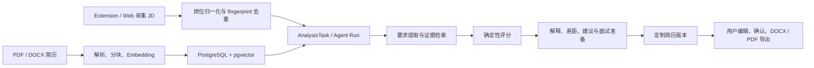
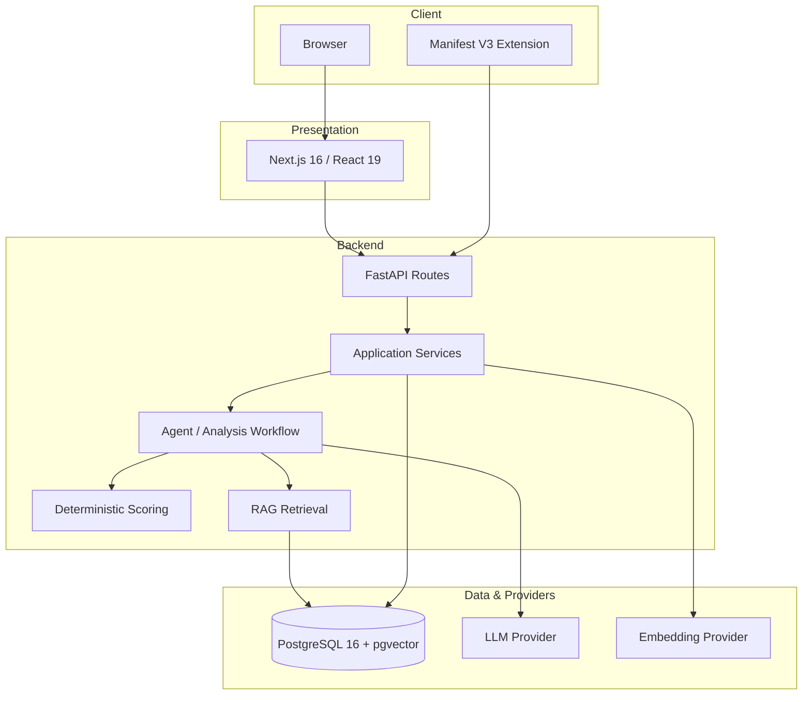

# AI Job Copilot 2.0 Showcase

## 一句话介绍

AI Job Copilot 是一个可本地复现的 AI 求职工作台：用浏览器扩展或 Web 工作区收集岗位，把 PDF / DOCX 简历转为可检索知识库，再通过受控 Agent Workflow 和后端确定性评分生成有证据、可恢复、可解释的岗位分析与定制简历。

## 展示重点

这个项目重点展示的不是一次模型调用，而是 AI 能力如何进入一条可靠的软件工程链路：

- **数据进入有边界**：岗位、简历、用户配置与工作流结果都有明确的数据模型和用户隔离。
- **模型输出受约束**：LLM 提取要求、证据和说明，最终评分由后端规则计算。
- **结论可以追溯**：RAG 结果关联真实简历片段，页面可以展示证据来源。
- **长流程可以恢复**：任务与 Agent 步骤持久化，包含 claim、lease、重试和恢复语义。
- **Demo 可以复现**：Docker Compose、healthcheck、Alembic、幂等 Seed 和 Windows 启停入口组成完整交付路径。

## 产品闭环



### 1. 岗位采集与管理

Manifest V3 Extension 支持从招聘页面读取选中文本或识别岗位详情区域，也可以在 Web 中手动创建岗位。Backend 对 URL 与内容做归一化，通过 fingerprint、唯一约束和冲突恢复保持重复保存幂等。

### 2. 简历知识库与 RAG

用户上传 PDF / DOCX 后，Backend 负责解析、内容哈希去重、文本分块和 Embedding。向量写入 pgvector；检索接口返回相似片段、来源文档和分数，为分析提供可回溯证据。

### 3. 受控分析与 Agent Workflow

工作流读取已保存的 Job 与 Profile，调用 Provider 提取岗位要求，检索候选人证据，再进入后端评分。Agent Run 和每个步骤都持久化，UI 可以轮询或恢复当前运行，而不是依赖一次长连接或页面内临时状态。

### 4. 确定性评分与解释

模型不能自由给出最终匹配分。后端使用固定状态映射、维度权重和“不适用”归一化规则计算结果；模型生成的解释必须依附于结构化要求和检索证据。这样可以单独测试评分规则，也便于定位结果变化来自模型还是业务逻辑。

### 5. 定制简历与用户确认

系统可以基于岗位、源简历和证据生成定制简历草稿，支持编辑、保存、定稿和 DOCX / PDF 导出。它不会伪造经历，也不会替用户自动投递；所有最终内容仍由用户审核。

## 系统架构



### 分层职责

| 层 | 职责 |
| --- | --- |
| Next.js / Extension | 用户交互、岗位采集、状态展示；不持有 Provider 密钥 |
| FastAPI Routes | HTTP 契约、认证依赖、请求校验、错误映射 |
| Application Services | 用例编排、事务边界、用户隔离与业务约束 |
| Workflow | 固定步骤执行、状态持久化、恢复与重试 |
| Retrieval / Scoring | 证据检索与确定性业务计算 |
| Repository / Infrastructure | SQLAlchemy、PostgreSQL、pgvector、文档与 Provider 适配 |

更完整的组件关系、Agent 时序和启动拓扑见 [architecture.md](architecture.md)。

## 技术亮点拆解

### RAG 不是装饰层

简历 chunks、Embedding、相似度结果和 Analysis evidence 都进入数据模型。展示时可以从分析结论回到具体简历片段，避免只呈现不可验证的自然语言总结。

### Agent 不绕过业务状态机

AnalysisTask 保留 CAS/version、claim token、lease、retry 和 recovery 语义；Agent 使用固定节点并持久化步骤。即使页面刷新或进程中断，应用仍能依据数据库状态恢复，而不是让模型直接修改任意业务状态。

### 幂等与并发行为可测试

Job fingerprint 同时考虑 URL/内容归一化、数据库唯一性与冲突恢复。文档使用内容哈希识别重复上传。关键结果不依赖前端“按钮禁用”来保证正确性。

### 不可信内容隔离

招聘网页、JD 和简历中的文字一律视为数据。系统不会把其中要求泄密、改变规则或执行工具的内容升级为指令；安全回归覆盖嵌套结果、trace 和 evidence 的脱敏显示。

### AI 生成保留人工决策

沟通稿、建议和定制简历只生成草稿或可复制内容，不连接自动发送、自动聊天或自动投递接口。产品边界在代码流程和文档口径中保持一致。

## 当前验证快照

验证日期：2026-08-05（Asia/Shanghai）。

| 检查 | 结果 | 说明 |
| --- | --- | --- |
| Backend pytest | PASS | 246 passed，1 skipped |
| Python compileall | PASS | `backend/app` 编译检查通过 |
| Frontend Node tests | PASS | 26 passed |
| Frontend typecheck | PASS | TypeScript 无错误 |
| Frontend production build | PASS | Next.js production build 成功 |
| Extension Node tests | PASS | 2 passed |
| Docker Compose config | PASS | Compose 配置解析通过 |
| Alembic heads | PASS | 唯一 head：`20260730_0012` |

自动化测试合计 **274 passed，1 skipped**。

本次快照没有重新调用真实 LLM / Embedding Provider，没有重新执行真实浏览器人工 E2E，也没有启动完整 Compose 栈做运行态验收。2026-07-24 的独立验收曾覆盖 Docker 冷启动、HTTP 健康、PostgreSQL、Job 去重、文档解析、真实 Embedding / RAG 与 Agent 链路；其环境、证据和 NOT VERIFIED 项见 [历史验收报告](demo-acceptance-report-2026-07-24.md)。

## 3 分钟展示路线

| 时间 | 页面 / 动作 | 重点 |
| --- | --- | --- |
| 0:00–0:20 | `start_demo.bat` 与 healthy 服务 | 可复现交付：Compose、migration、Seed、healthcheck |
| 0:20–0:45 | Dashboard | 真实工作区聚合，不使用页面假数据 |
| 0:45–1:10 | Jobs | 岗位来源、搜索筛选与 fingerprint 幂等 |
| 1:10–1:55 | Job Detail | AnalysisTask、Agent steps、确定性评分与 evidence |
| 1:55–2:25 | Resumes | PDF / DOCX、chunks、Embedding 与语义检索 |
| 2:25–2:45 | Tailored Resume | 证据支持的草稿、编辑、确认和导出 |
| 2:45–3:00 | 架构图 | 模型能力与业务控制边界 |

演示前建议使用已保存的 Demo 分析作为稳定主线，把实时 Provider 调用和 Extension 现场采集作为可选加演。完整话术与故障兜底见 [demo-script.md](demo-script.md)，截图准备见 [screenshot-guide.md](screenshot-guide.md)。

## 部署方式

本地推荐直接双击根目录 `start_demo.bat`。开发者可以手动执行：

```powershell
docker compose up --build -d
docker compose exec backend python -m alembic -c alembic.ini upgrade head
docker compose exec backend python backend/scripts/seed_demo.py
docker compose ps
```

详细配置、验证、日志、停止、数据卷和排障说明见 [../DOCKER.md](../DOCKER.md)。

## 项目边界与后续方向

当前已具备本地 Demo 的完整工程闭环，但不等同于生产 SaaS：

- Demo Token 不是正式认证，当前没有 RBAC、组织或多人协作。
- 没有公网 TLS、Secret 托管、备份恢复、监控告警或高可用方案。
- Extension 的通用提取策略不能保证覆盖所有招聘网站和页面版本。
- 外部 Provider 的延迟、限流和质量仍会影响实时分析。
- 匹配结果与生成内容需要用户复核，不构成招聘或职业决策保证。
- 自动投递、自动聊天和绕过网站限制明确不在范围内。

合理的下一阶段方向是：正式身份认证、Provider 可观测性、异步文档处理、人工浏览器 E2E、PostgreSQL 并发压测，以及在不突破用户确认边界的前提下增强定制简历体验。

## 文档索引

- [README](../README.md)：项目入口、能力概览与快速启动
- [Docker 部署](../DOCKER.md)：本地部署、配置、验证和排障
- [架构说明](architecture.md)：全栈拓扑、分层和 Agent / RAG 时序
- [演示脚本](demo-script.md)：3 分钟演示话术和失败兜底
- [截图规范](screenshot-guide.md)：展示截图准备要求
- [Web 功能审计](web-feature-audit-2026-07-30.md)：页面闭环与明确 out-of-scope
- [历史验收报告](demo-acceptance-report-2026-07-24.md)：Docker / API / RAG / Agent 验收证据
